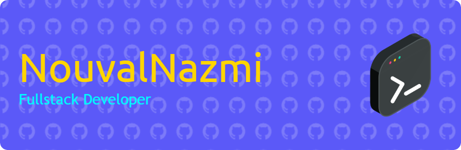

  

   

    
     
    <b>👀 Total Visitors </b>

---

<table align="center">
  <tr>
    <td>
      <h2 align="center">🚀 From Teaching to Tech: My Developer Journey</h2>
       
      
      

        My journey into tech didn’t begin with code—it started in the classroom. Fresh out of high school, I dedicated a year to teaching at a junior high school, mentoring young minds while quietly igniting my own passion for technology.
      

      

        That passion led me to immerse myself in web development, transforming late-night coding marathons into tangible skills. After a year of teaching, I took a leap of faith and enrolled in an intensive 4-month full-stack web development bootcamp. It was a game-changer.
      

      

        Today, as a full-stack developer, I don't just write code—I craft experiences, solve real-world problems, and continuously push the boundaries of innovation. The journey is ongoing, and I’m only getting started. 🚀
      

    </td>
  </tr>
</table>

---

  

---

<h2 align="center">⚡ Tech Superpower Showcase</h2>

  
  
  
  
   
  
  
  
  
   
  
  
  
   
  
  
  
   
  
  
  
   
  
  
  
   
  
  
  

---

<h2 align="center">📊 GitHub Stats</h2>

  

  

  

---

<h2 align="center">📥 Connect With Me 📥</h2>

  
  
  
  
  
  

  

  

